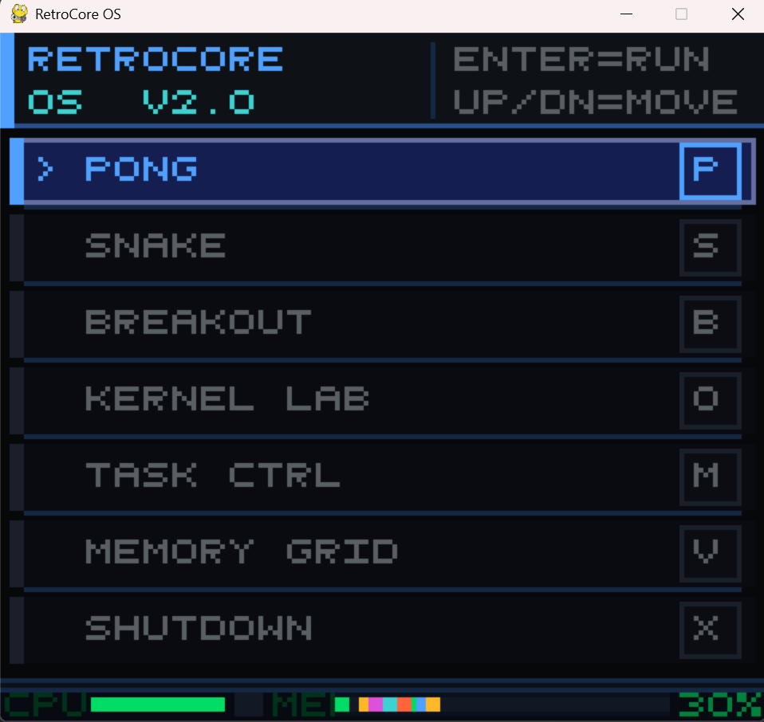
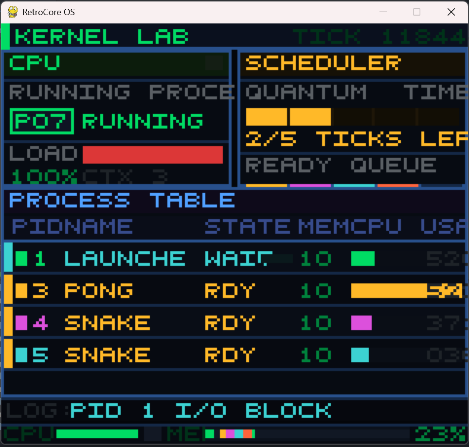
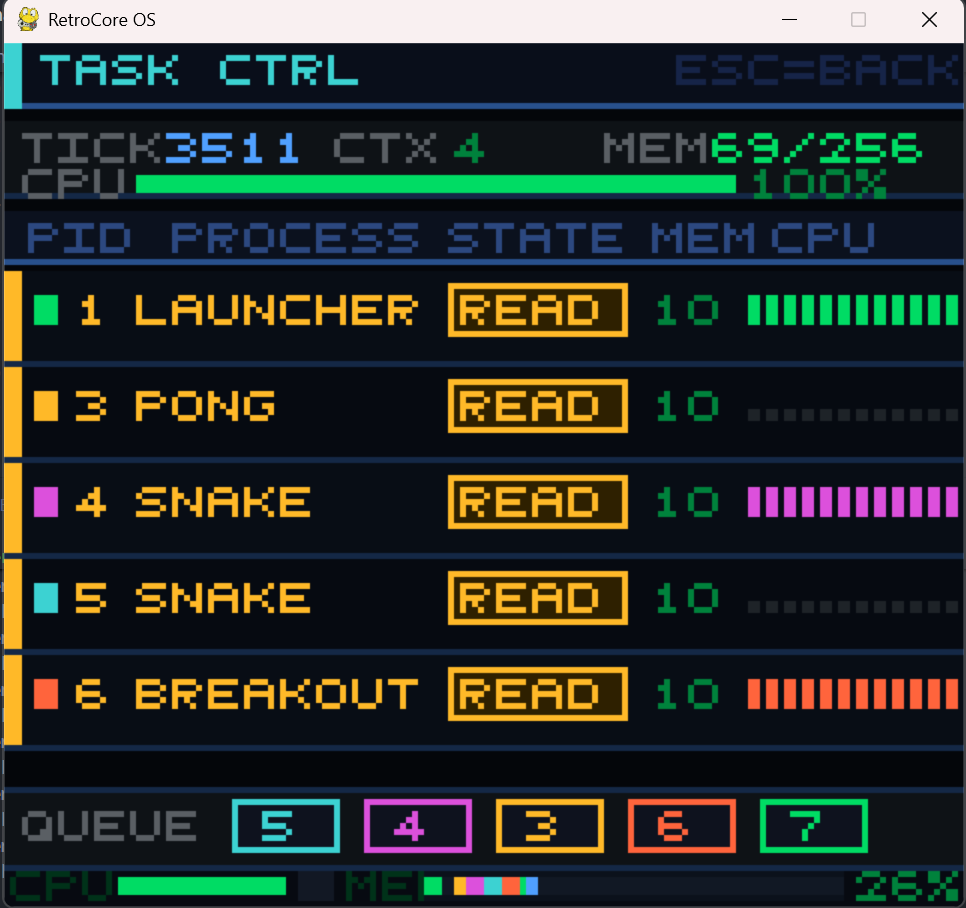
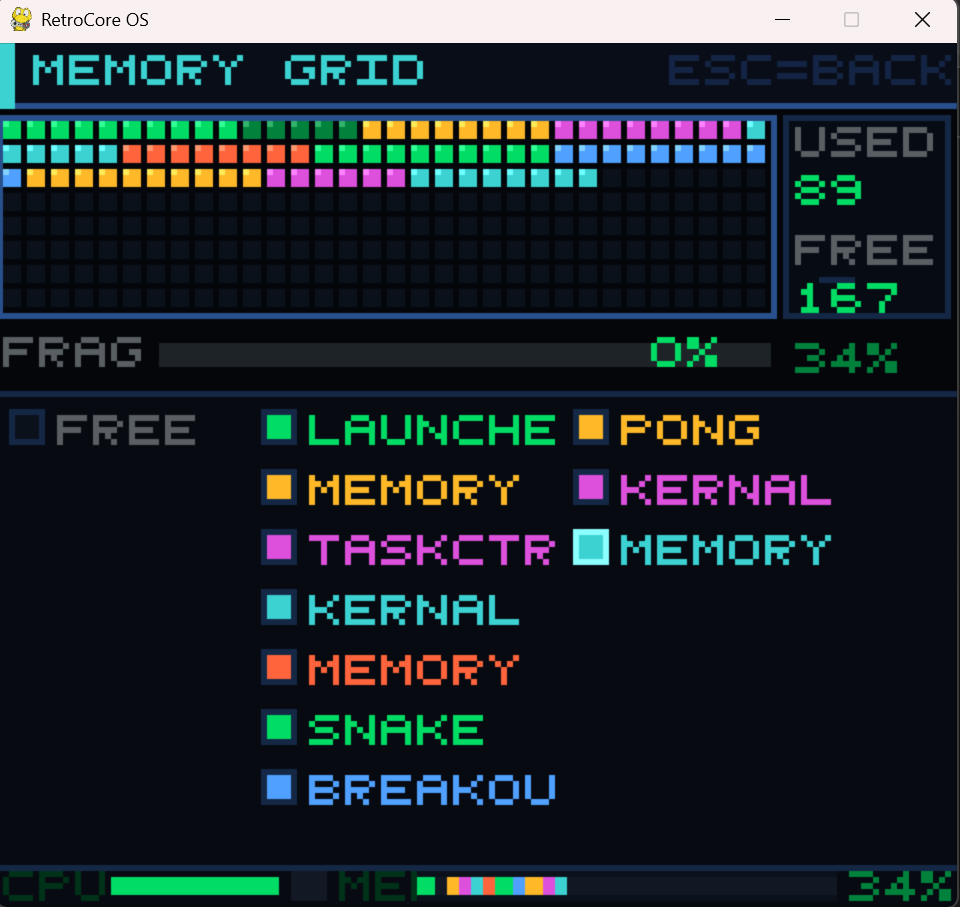
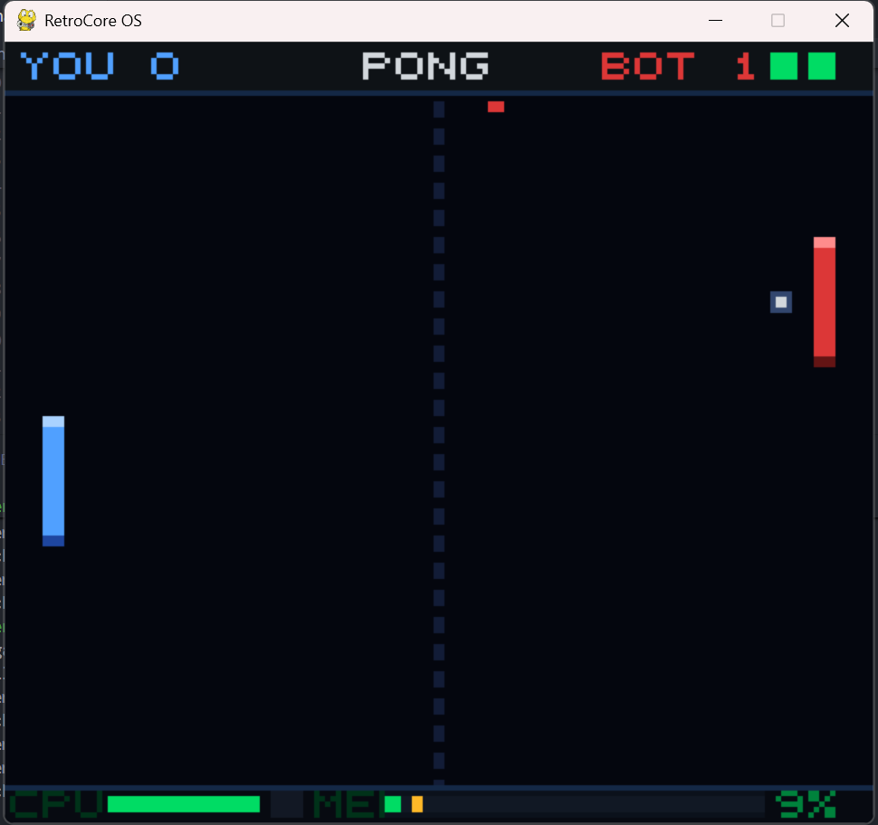
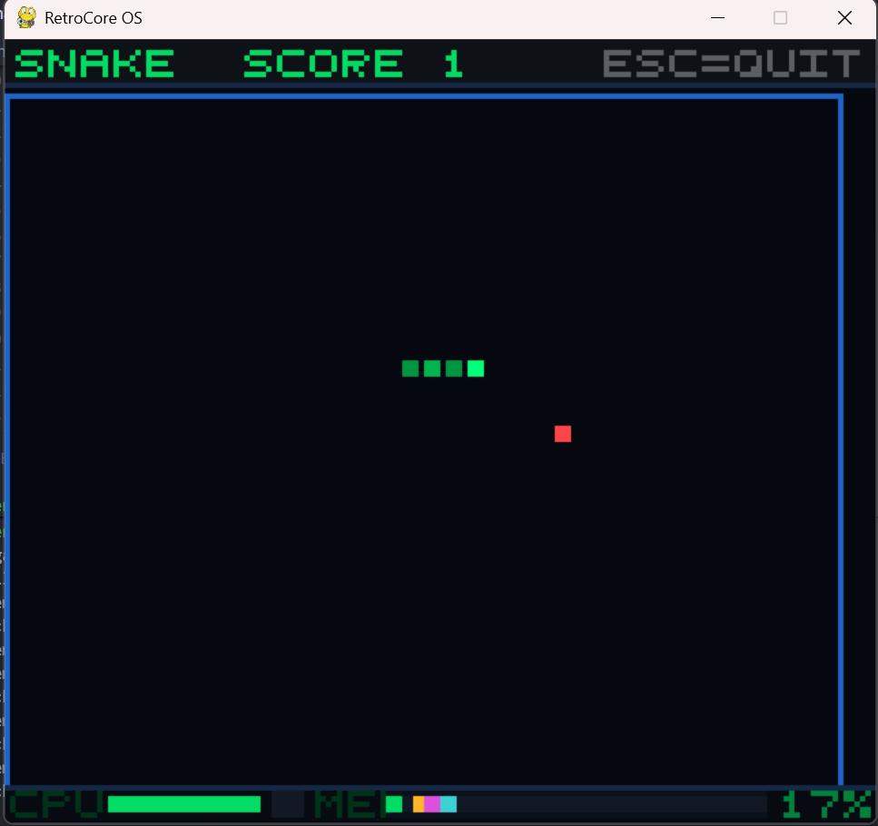
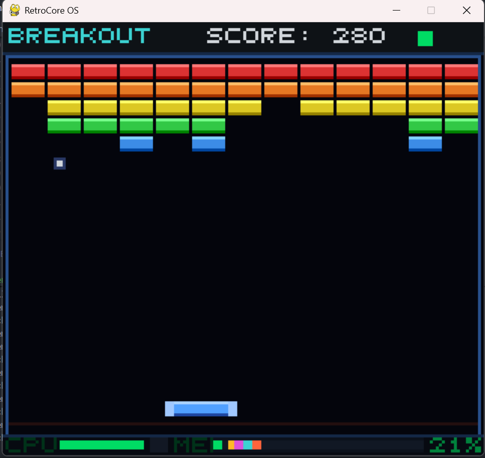

# RetroCore OS

*A Visual Operating System Simulator*

---

## 1. Overview

RetroCore OS is a graphical operating system simulator built using Python and Pygame. It demonstrates core OS concepts — CPU scheduling, memory management, and process lifecycle — through an interactive retro-style interface where games act as live processes.

The system is designed as a **"glass-box OS"**: every internal kernel operation (context switches, memory allocation, process state changes, I/O blocking) is surfaced visually in real time through dedicated monitoring panels.

---

## 2. Screenshots

### Main Menu


### Kernel Lab


### Task Ctrl


### Memory Grid


### Pong


### Snake


### Breakout


---

## 3. Features

### Core OS Functionality

- **Round-Robin Scheduler**
  - Foreground process runs every frame (no preemption)
  - Background processes share CPU using a time quantum
  - Exposes ready queue, CPU load, and context-switch flash indicator

- **Memory Management**
  - First-fit contiguous block allocation
  - Dynamic allocation and deallocation with animated flash on change
  - Real-time fragmentation measurement and visualisation

- **Process Lifecycle**
  - NEW → READY → RUNNING → WAITING → READY → TERMINATED
  - PID tracking, CPU time monitoring, per-process activity history

- **Kernel Event Bus**
  - Games emit real events (food eaten, paddle hit, ball lost) via `os_api.log_event()`
  - Events appear live in the Kernel Lab event log

### Hardware Abstraction

- Custom **Display Engine** — NumPy framebuffer + single-blit Pygame rendering (zero per-frame allocations)
- Keyboard abstraction via `InputDevice`
- `OS_API` layer: all apps communicate with hardware exclusively through this interface

### Applications

| App | Role |
|---|---|
| Launcher | Main menu — creates and terminates processes |
| Pong | Game — logs paddle hits, points, misses |
| Snake | Game — logs food events, collisions, speed changes |
| Breakout | Game — logs brick scores, ball loss, level clear |
| Kernel Lab | Glass-box OS monitor: CPU panel, scheduler panel, process table, event log |
| Task Ctrl | Process table with sparklines, WAITING bars, ready queue strip |
| Memory Grid | Animated 256-block grid with alloc/free flash and fragmentation bar |
| System Dashboard | Always-visible bottom overlay on every screen |

---

## 4. System Architecture

```
 ┌─────────────────────────────────────────┐
 │      User Apps  (Games + Monitors)      │
 └────────────────────┬────────────────────┘
                      │  OS_API (syscall.py)
 ┌────────────────────▼────────────────────┐
 │              Kernel Layer               │
 │  RoundRobinScheduler  MemoryManager     │
 │  Process              Kernel Event Bus  │
 └────────────────────┬────────────────────┘
                      │
 ┌────────────────────▼────────────────────┐
 │            Hardware Layer               │
 │     Display (NumPy)    InputDevice      │
 └─────────────────────────────────────────┘
```

---

## 5. How It Works

- Each app runs as a **Process** with a PID, memory allocation, and state
- The **Scheduler** runs the foreground process every frame; background processes share CPU via round-robin time slices
- The **Memory Manager** allocates contiguous blocks; freed blocks flash red in the Memory Grid
- The **Display** renders a 160×144 framebuffer scaled to the window — one NumPy blit per frame
- The **System Dashboard** overlay shows CPU load, context-switch indicator, and memory usage on every screen
- The **Kernel Event Bus** (`_event_log` on `OS_API`) collects real events from games and surfaces them in Kernel Lab

---

## 6. Controls

| Key | Action |
|---|---|
| ↑ / W | Navigate up / Snake up / Pong paddle up |
| ↓ / S | Navigate down / Snake down / Pong paddle down |
| ← / A | Snake left / Breakout paddle left |
| → / D | Snake right / Breakout paddle right |
| ENTER | Launch app / Retry after game over |
| ESC | Exit current app → back to Launcher |
| X | Alternative back button |

---

## 7. Installation

### Requirements

- Python 3.8+
- Dependencies in `requirements.txt`

### Install and Run

```bash
pip install -r requirements.txt
python main.py
```

---

## 8. Project Structure

```
Retro-game-OS-simulation/
│
├── main.py
│
├── kernel/
│   ├── __init__.py
│   ├── scheduler.py        # Round-Robin scheduler
│   ├── memory_manager.py   # First-fit allocator with flash animation
│   ├── process.py          # Process model with state + CPU history
│   └── syscall.py          # OS_API + kernel event bus
│
├── hardware/
│   ├── __init__.py
│   ├── display.py          # NumPy framebuffer, scaled rendering
│   ├── input_device.py     # Keyboard abstraction
│   └── font.py             # 5×5 pixel bitmap font
│
├── apps/
│   ├── __init__.py
│   ├── ui.py               # Shared colour palette + drawing helpers
│   ├── launcher.py
│   ├── pong.py
│   ├── snake.py
│   ├── breakout.py
│   ├── os_monitor.py       # Kernel Lab (glass-box monitor)
│   ├── system_monitor.py   # Task Ctrl
│   ├── memory_viewer.py    # Memory Grid
│   └── system_dashboard.py # Bottom overlay
│
├── requirements.txt
└── README.md
```

---

## 9. Strengths

- Clean three-layer architecture with no cross-layer dependencies
- Flicker-free rendering via foreground/background scheduler split and NumPy blit
- Real kernel events from game code — the glass-box simulation is genuine
- Memory animation (alloc flash, free fade, fragmentation bar) visually demonstrates dynamic allocation
- Consistent colour system (`ui.py`) makes all screens immediately recognisable

---

## 10. Limitations

- Fixed logical resolution (160×144) — layout values are hardcoded pixel coordinates
- No process priority levels — all processes treated equally by the scheduler
- Memory allocation is contiguous first-fit only — no paging or segmentation
- Background processes receive no visual representation while running
- No inter-process communication

---

## 11. Future Improvements

- Dynamic resolution — compute layout from window dimensions
- Process priority queues
- Paged memory — demonstrate virtual vs physical address spaces
- Inter-process communication via shared memory or message passing
- More games (Tetris, Space Invaders)
- Animated context-switch transition

---

## 12. Conclusion

RetroCore OS demonstrates how an operating system manages processes, memory, and execution flow in a simplified yet visually accurate way. The kernel event bus and foreground/background scheduler split are the two design decisions that most directly achieve the glass-box goal — making kernel behaviour observable and understandable in real time.